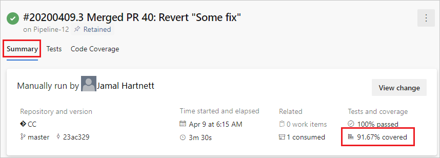

By code coverage, we mean the action of trying to measure how much of our code has been executed by our tests.
This sound like 

> __TL;DR__ 
>
> Untested code is a broken code.
> Definitely a strong statement but true in a way, we don't always manage to get enough coverage.
> Often this happens because we don't have time, other times because despite having written tests we are not able to read the metrics. 

So, how we can "humanize" code coverage metrics? And how we can generate its?

To answer at these questions I usually use two libraries.



to gather metrics, and



for generate human-readable reports.

## How can set-up __*coverlet*__?

I usually include [coverlet.msbuild](https://www.nuget.org/packages/coverlet.msbuild/) by [MSBuild .targets Files - Visual Studio | Microsoft Docs](https://docs.microsoft.com/en-us/visualstudio/msbuild/msbuild-dot-targets-files).



For alternative ways to include _coverlet_ into yout test project see also [coverlet-coverage/coverlet: Cross platform code coverage for .NET (github.com)](https://github.com/coverlet-coverage/coverlet#Quick-Start).

## How can set-up __*ReportGenerator*__?

In keeping with above to include [ReportGenerator](https://www.nuget.org/packages/ReportGenerator) by [MSBuild .targets Files - Visual Studio | Microsoft Docs](https://docs.microsoft.com/en-us/visualstudio/msbuild/msbuild-dot-targets-files).



Also this tool offer a various way to use it, you can find all ways onto official documentation [ReportGenerator - converts coverage reports generated by coverlet](https://danielpalme.github.io/ReportGenerator/).

## How to wire-up all that?

To make everything work we need to add another _MSBuild_ file.



And include this into your test project, something like this

```xml
<Project Sdk="Microsoft.NET.Sdk">

  <PropertyGroup>
    <TargetFramework>net5.0</TargetFramework>
  </PropertyGroup>

  <Import Project="Tests.targets" />
  
</Project>
```

Now everything you are able to run `dotnet test` you will able to inspect and analyze something like this


I think that is an amazing tool to understand at a glance which codes are covered and which not.

## And now, how I can put it into Azure DevOps pipeline?

It would be nice if this report came was published into the _Build pipeline_ report, don't you think? Maybe even include branch policies for it.

Well that's possible by use [Publish Code Coverage Results task](https://docs.microsoft.com/en-us/azure/devops/pipelines/tasks/test/publish-code-coverage-results), something like this:

```yaml
- task: PublishCodeCoverageResults@1
  displayName: Publish Code Coverage Results
  inputs:
    codeCoverageTool: 'cobertura'
    summaryFileLocation: '$(Build.SourcesDirectory)/artifacts/TestResults/$(_BuildConfig)/Reports/Summary/Cobertura.xml'
    continueOnError: true
    condition: always()
```

We notice the `summaryFileLocation` argument, this means that we will push only one file to _Azure DevOps_ why?

One unwrite note of _Publish Code Coverage Results task_ or limitation, I don't know, is that the sum of covered lines, when we publish more reports, is take from the first file 

This results in an unreliable result.

To fix that problem we can marge multiple reports into a summary reports so that can be publish it only one. One way to make it is the follow



and run _MSBuild_ project into the pipeline with

```yaml
- script: dotnet msbuild SummaryReportGenerator.proj /p:Configuration=$(Configuration)
  name: GenerateCodeCoverageSummary
  displayName: Generate code coverage summary
```

Once you've done this the sum of covered lines on _Build pipeline_ will true.

