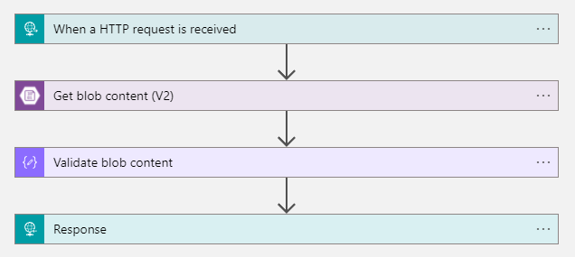

Tempo fa mi è capitato di dover valorizzare il JSON Web Token emesso da _Azure Active Directory B2C_ con informazioni presenti su un sistema esterno.

Per realizzare ciò sfruttai le possibilità di personalizzazione offerte dai _criteri personalizzati_.

## Introduzione ad Identity Expirience Framework. 

_Identity Expirience Framework_ rappresenta il contesto orchestrazione di un flusso di interazione con _Azure AD B2C_. I criteri personalizzati ne rappresentano l'espressività e ci consentono a noi sviluppatori di definire l'interno flusso attraverso una serie di uno o piὺ file di markup.

Qua trovate le [Informazioni sulle nozioni di base](https://docs.microsoft.com/azure/active-directory-b2c/custom-policy-overview#understanding-the-basics).

## Recuperare le informazioni.

In quel caso le informazioni venivano esposte da un web server esposto dietro _API Management_, per semplicità ho replicato l'endpoint con una _Logic App_. Questa e' la sua definizione:



Come si può immaginare il suo compito è quello di ritornare le informazioni contenute all'interno di un blob. In questo caso il blob contiene le informazioni che andreanno esposte come rivendicazioni del JWT.

In particolare dato l'`objectId`, che in questo caso rappresenta l'utente, verrà ritornato un _json_ con questo formato:

``` json
{
    "location": "IT",
    "work-teams": [
        "Star",
        "Eco"
    ]
}
```

## Creare il nostro criterio personalizzato.

L'obbiettivo dell'esempio è semplice e consiste nell'aggiungere al flusso di registrazione ed autenticazione le due attestazioni rispettivamente con i nomi `loc` per la _location_ e `wt` per i _work teams_.

> [NOTA]  
> Ogni volta che abbiamo la necessità di utilizzare _IEF_ è consigliabile partire da uno dei template che Microsoft ci mette a disposizione nello [starter pack](https://github.com/Azure-Samples/active-directory-b2c-custom-policy-starterpack), in questo esempio è stato usato [LocalAccounts](https://github.com/Azure-Samples/active-directory-b2c-custom-policy-starterpack/tree/63d382ae6cd78d2995a88653c7b7ed55876a8296/LocalAccounts).

La prima cosa da fare quindi è modificare il [`ClaimsSchema`](https://docs.microsoft.com/azure/active-directory-b2c/claimsschema) aggiungendo i `ClaimType`.

``` xml
<ClaimType Id="location">
    <DisplayName>Location</DisplayName>
    <DataType>string</DataType>
    <DefaultPartnerClaimTypes>
        <Protocol Name="OAuth2" PartnerClaimType="loc" />
        <Protocol Name="OpenIdConnect" PartnerClaimType="loc" />
        <Protocol Name="SAML2" PartnerClaimType="http://schemas.xmlsoap.org/ws/2005/05/identity/claims/location" />
    </DefaultPartnerClaimTypes>
    <UserHelpText>Your country (express with ISO 3166-1 alpha-2 format).</UserHelpText>
</ClaimType>
```

``` xml
<ClaimType Id="workTeams">
    <DisplayName>Groups</DisplayName>
    <DataType>stringCollection</DataType>
    <DefaultPartnerClaimTypes>
        <Protocol Name="OAuth2" PartnerClaimType="wt" />
        <Protocol Name="OpenIdConnect" PartnerClaimType="wt" />
        <Protocol Name="SAML2" PartnerClaimType="http://schemas.xmlsoap.org/ws/2005/05/identity/claims/workteams" />
    </DefaultPartnerClaimTypes>
    <UserHelpText>Work teams you belong to.</UserHelpText>
</ClaimType>
```

L'attributo `PartnerClaimType` dell'elemento `Protocol` rappretenta il nome che sarà usato per identificare l'attestazione sulla base del protocollo supportato.

A questo punto potremmo valorizzarli attraverso una chiamata HTTP alla _Logic App_. Per farlo dovremmo creare un [`TechnicalProfile`](https://docs.microsoft.com/azure/active-directory-b2c/restful-technical-profile), che in questo casa sarà cosi definito:

``` xml
<TechnicalProfile Id="AAD-UserDetailsReadUsingObjectId">
    <DisplayName>Provide identity customer details</DisplayName>
    <Protocol Name="Proprietary" Handler="Web.TPEngine.Providers.RestfulProvider, Web.TPEngine, Version=1.0.0.0, Culture=neutral, PublicKeyToken=null" />
    <Metadata>
        <Item Key="ServiceUrl">https://localhost/customers/{objectId}</Item>
        <Item Key="AuthenticationType">None</Item>
        <Item Key="SendClaimsIn">Url</Item>
    </Metadata>
    <InputClaims>
        <InputClaim ClaimTypeReferenceId="objectId" Required="true" />
    </InputClaims>
    <OutputClaims>
        <OutputClaim ClaimTypeReferenceId="workTeams" PartnerClaimType="work-teams" />
        <OutputClaim ClaimTypeReferenceId="location" PartnerClaimType="location" />
    </OutputClaims>
    <IncludeTechnicalProfile ReferenceId="AAD-UserReadUsingObjectId" />
</TechnicalProfile>
```

Dove l'elemento `Protocol` serve ad identificare il tipo di `TechnicalProfile` il cui comportamento viene definito mediante l'elemento `Metadata`.

Come abbiamo visto in precedenza nel paragrafo [Recuperare le informazioni](#Recuperare_le_informazioni) necessita `objectId`, per cui:

- `ServiceUrl` identifica l'endpoint HTTP dove gli input possono essere passati mediante il placeholder `{claim}`
- `SendClaimsIn` instruisce l'assembly `Web.TPEngine.Providers.RestfulProvider` sul luogo nel quale devono essere passati i claims

`OutputClaims` invece ha il compito di eseguire il mapping fra le proprietà contenute nella risposta e i `ClaimType` definiti in precedenza.

L'ultima cosa da fare è modificare il [`RelyingParty`](https://docs.microsoft.com/azure/active-directory-b2c/relyingparty) aggiungendo alla proprietà `OutputClaims` i referimenti agli oggetti

``` xml
<OutputClaim ClaimTypeReferenceId="location" />
```

e

``` xml
<OutputClaim ClaimTypeReferenceId="workTeams" />
```

per ottenere infine


## Risoluzione di problemi e aiuto nello sviluppo.

Immancabilmente durante lo sviluppo ci potrebbero essere degli errori, errori che _Azure AD B2C_ riporta come all'interno del redirect url e che jwt.ms trasforma cosi


Fortunatamente nelle operazioni di troubleshooting può venirci incontro _Application Insights_, per le operazioni di configurazione potete fare riferimento a questa guida [Raccogliere Azure Active Directory log B2C con Application Insights](https://docs.microsoft.com/azure/active-directory-b2c/troubleshoot-with-application-insights?pivots=b2c-custom-policy#see-the-logs-in-vs-code-extension).

Un altra difficoltà risiede nel fatto che la definizione dei criteri personalizzati utilizza un linguaggio di markup, ormai chi è piὺ in grado di sviluppare senza auto completamento?

A questo problema ha pensato la community [Azure AD B2C](https://azure-ad-b2c.github.io/azureadb2ccommunity.io) realizzando un'[estensione per _VS code_](https://github.com/azure-ad-b2c/vscode-extension).

Inoltre ha realizzato diversi scenari di esempio che possono tornare utili [Azure Active Directory B2C: Custom CIAM User Journeys](https://github.com/azure-ad-b2c/samples).

Infine se foste interessati all’esempio completo lo potrete trovare al seguente indirizzo [https://github.com/binick/samples/tree/master/src/enrich-a-jwt-token-with-ief](https://github.com/binick/samples/tree/master/src/enrich-a-jwt-token-with-ief).
