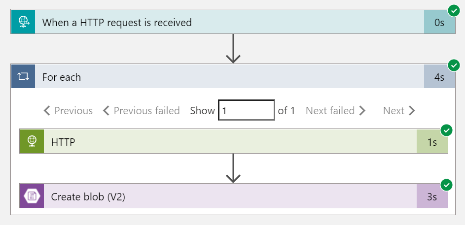

In the previous post, we have seen [how to enrich a JWT issued by Active Directory B2C with custom policies](../2021-12-27_enrich-a-jwt-token-with-ief).

In that post, we talked about how it's possible to add information external to _Microsoft Graph_ to a JWT through the use of a _Logic App_ and a _Blob Storage_.

Instead, in this one, we will see how it is possible to create a solution that integrates _Azure Active Directory B2C_.

Following the track of what we covered in the previous post, we will see how to save on _Blob Storage_ dummy data at user registration.


Throughout the rest of the article, there are references to resources and concepts covered in the [previous article](../2021-12-27_enrich-a-jwt-token-with-ief) to which we refer. 


## Solution overview.

The solution is composed as follows:


- `read-customer-details-identity-la`: represents the API whose purpose is to retrieve the content of the _blob_ from `customersstgacc` (the _storage account_)
- `customer-register-tpc`: is the _topic_ in which are collected the events of the creation of a new user
- `customer-identity-details-filler-la`: it represents the API that is in charge of generating fictitious data that will be saved inside a _blob_ on the `customersstgacc`

- `contoso-b2c`: is the access and identity management service offered by _Azure_

## Introduction to _Azure Event Grid_.

In _Azure_ there is an implementation of the [publish/subscribe](https://en.wikipedia.org/wiki/Publish%E2%80%93subscribe_pattern) pattern designed to facilitate integration and resource management via an event-driven development paradigm.

Through the _Event Grid_ will be possible to subscribe to [built-in message sources](https://docs.microsoft.com/azure/event-grid/overview#event-sources) via a [set of handlers](https://docs.microsoft.com/azure/event-grid/overview#event-handlers).

If this is not enough, it is possible to create custom _topics to which you can subscribe to receive events.

## Creating a custom _topic_.

You can refer to [this guide](https://docs.microsoft.com/azure/event-grid/custom-event-quickstart-portal#create-a-custom-topic) to create a _topic_.

One choice to make when creating the _topic_ concerns the scheme of the _HTTP_ request content used. Currently, supported schemas are:

- [`Event Grid Schema`](https://docs.microsoft.com/azure/event-grid/event-schema)
- [`Cloud Event Schema`](https://docs.microsoft.com/azure/event-grid/cloud-event-schema)
- `Custom Input Schema` this schema will require the creation of an [association](https://docs.microsoft.com/azure/event-grid/input-mappings) between the properties of the input object and those required by the `Event Grid Schema`

The message used in this case has the following structure

``` json
[
    {
        "data": {
            "objectId": "25100647-0dcc-4571-b7b4-b03e4ce72d02" // unique user identifier
        },
        "id": "25100647-0dcc-4571-b7b4-b03e4ce72d02", // unique message identifier, the same of `data.objectId` in this case
        "eventType": "Microsoft.ActiveDirectory", 
        "subject": "contosob2cqtofmpm.onmicrosoft.com",
        "dataVersion": "1.0",
        "metadataVersion": "1",
        "eventTime": "2021-12-03T21:04:03.8504745Z",
        "topic": "/subscriptions/{your-subscription-id}/resourceGroups/{your-resource-group}/providers/Microsoft.EventGrid/topics/{your-event-grid-topic}"
    }
]
```

## Issuing the registration event.

Sending events to the _topic_ is done using a [`RESTful technical profile`](https://docs.microsoft.com/azure/active-directory-b2c/restful-technical-profile).

``` xml
<TechnicalProfile Id="AAD-UserEmitRegistrationEvent">
    <DisplayName>Emit user registration event to Event Grid.</DisplayName>
    <Protocol Name="Proprietary" Handler="Web.TPEngine.Providers.RestfulProvider, Web.TPEngine, Version=1.0.0.0, Culture=neutral, PublicKeyToken=null" />
    <Metadata>
        <Item Key="ServiceUrl">{Settings:CustomerRegisteredTopicUrl}</Item>
        <Item Key="AuthenticationType">ApiKeyHeader</Item>
        <Item Key="SendClaimsIn">Body</Item>
        <Item Key="ClaimUsedForRequestPayload">userRegisterEvent</Item>
        <Item Key="DefaultUserMessageIfRequestFailed">Cannot process your request right now, please try again later.</Item>
    </Metadata>
    <CryptographicKeys>
        <Key Id="aeg-sas-key" StorageReferenceId="B2C_1A_CustomerRegisteredTopicSas" />
    </CryptographicKeys>
    <InputClaimsTransformations>
        <InputClaimsTransformation ReferenceId="GetSystemDateTime" />
        <InputClaimsTransformation ReferenceId="GenerateRegistrationEventRequest" />
    </InputClaimsTransformations>
    <InputClaims>
        <InputClaim ClaimTypeReferenceId="userRegisterEvent" />
    </InputClaims>
    <PersistedClaims>
        <PersistedClaim ClaimTypeReferenceId="systemDateTime" />
    </PersistedClaims>
    <UseTechnicalProfileForSessionManagement ReferenceId="SM-AAD" />
</TechnicalProfile>
```

This fragment of markup translated into `curl` command, for more explicability, would look like this:

``` bash
curl -X POST -H "aeg-sas-key: $key" -d "$event" $endpoint
```

where the authentication requirements are met by the `AuthenticationType` metadata to which is associated the cryptographic key `aeg-sas-key` whose value is retrieved from the key `B2C_1A_CustomerRegisteredTopicSas` present in the collection of [policy keys](https://docs.microsoft.com/azure/active-directory-b2c/policy-keys-overview?pivots=b2c-custom-policy).

 
> The choice of the _topic_ template in this example was guided by the limitations currently imposed by the [_RESTful_ technical profile](https://docs.microsoft.com/azure/active-directory-b2c/restful-technical-profile) regarding the possibilities of building the _HTTP_ request, in fact for a combination of criteria it is not possible to pass information in the headers and the body of the request at the same time.  
This makes it impossible to send towards a _topic_ schemes of type `Cloud Event` since the protocol, in version _1.0_ requires the presence of a [mandatory header](https://docs.microsoft.com/azure/event-grid/cloud-event-schema#sample-event-using-cloudevents-schema).


Much more complex is the creation of the body of the request for which it is necessary:

- use the [`InputClaimsTransformation`](https://docs.microsoft.com/azure/active-directory-b2c/technicalprofiles#input-claims-transformations)
- add two statements inside the baggage `userRegisterEvent` and `systemDateTime` both of type _string_.

Finally, the _technical profile_ has been added among the _technical validation profiles_ of [`LocalAccountSignUpWithLogonEmail`](https://github.com/binick/samples/blob/7782bd6bfcfcb8c2b18dc911d501b29ec05f8212/src/enrich-a-jwt-token-with-ief/ief/TrustFrameworkBase.xml#L764) so that the event is issued only when a user is registered.

### Using claim transformations.

During the creation of _custom criteria_ we could have the necessity to execute calculations, as the number of attempts of authentication, that even if very simple would result impossible without the execution of functions.

This requirement finds expressivity through the `ClaimsTransformation` whose [reference of the transformations of the claims](https://docs.microsoft.com/azure/active-directory-b2c/claimstransformations#claims-transformations-reference) contains the complete list of the _transformations_ usable.

In the example the methods [`GetCurrentDateTime`](https://docs.microsoft.com/azure/active-directory-b2c/date-transformations#getcurrentdatetime) and [`GenerateJson`](https://docs.microsoft.com/azure/active-directory-b2c/json-transformations#generatejson) were used

`` xml
<ClaimsTransformation Id="GetSystemDateTime" TransformationMethod="GetCurrentDateTime">
    <OutputClaims>
        <OutputClaim ClaimTypeReferenceId="systemDateTime" TransformationClaimType="currentDateTime" />
    </OutputClaims>
</ClaimsTransformation>
```

The purpose of `GetSystemDateTime` is to enhance the `systemDateTime` claim.

`` xml
<ClaimsTransformation Id="GenerateRegistrationEventRequest" TransformationMethod="GenerateJson">
    <InputClaims>
        <InputClaim ClaimTypeReferenceId="objectId" TransformationClaimType="0.data.objectId" />
        <InputClaim ClaimTypeReferenceId="objectId" TransformationClaimType="0.id" />
        <InputClaim ClaimTypeReferenceId="systemDateTime" TransformationClaimType="0.eventTime" />
    </InputClaims>
    <InputParameters>
        <InputParameter Id="0.dataVersion" DataType="string" Value="1.0" />
        <InputParameter Id="0.eventType" DataType="string" Value="Microsoft.ActiveDirectory" />
        <InputParameter Id="0.subject" DataType="string" Value="{Settings:Tenant}" />
    </InputParameters>
    <OutputClaims>
        <OutputClaim ClaimTypeReferenceId="userRegisterEvent" TransformationClaimType="outputClaim" />
    </OutputClaims>
</ClaimsTransformation>
```

`GenerateRegistrationEventRequest` has instead the burden of constructing the JSON and enhancing the `userRegisterEvent` claim.

## Conclusions.

In this article, we have seen how through _Identity Experience Framework_ it is possible to integrate a B2C tenant with our infrastructure and open possible interesting development scenarios.  
To do this we touched on _Azure Event Grid_ and how to create an _Event Grid Topic_.

Finally how you can [manipulate attestations](https://docs.microsoft.com/azure/active-directory-b2c/claimstransformations#claims-transformations-reference) and use them within [_technical profiles_](https://docs.microsoft.com/azure/active-directory-b2c/technicalprofiles).

If you are interested in the complete example you can find it at [https://github.com/binick/samples/tree/master/src/enrich-a-jwt-token-with-ief](https://github.com/binick/samples/tree/master/src/enrich-a-jwt-token-with-ief).
