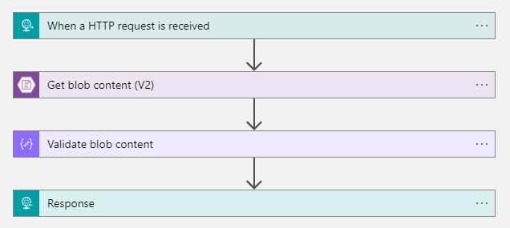
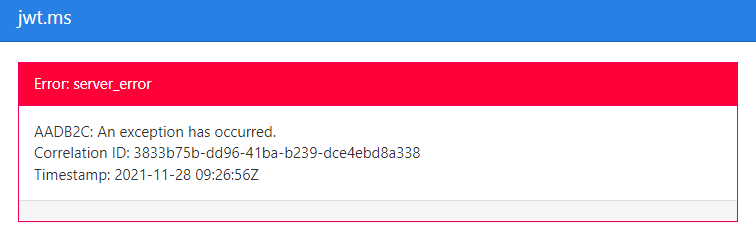

---
title: How to enrich a JWT issued by Active Directory B2C with custom policies.
date: 2021-12-27
author: Nicola Biancolini
description: Azure Active Directory B2C is the Identity system offered by Microsoft and hosted on Azure. Its strength is the complete integration with all identities and resources managed in our tenant on Azure. It offers a set of cooked and eaten presonalizations for authentication and authorization flows, but sometimes there are cases where these flows are not enough and in this post we see how you can customize them.
series: 
  - Identity Experience Framework
keywords: 
  - identity experience framework
  - active directory b2c
  - custom policy
  - azure blob storage
tags: 
  - azure
  - active directory b2c
aliases:
  - /posts/2021-12-27_enrich-a-jwt-token-with-ief
  - /posts/2021-12-25_enrich-a-jwt-token-with-ief
  - /posts/2021-12-27_enrich-a-jwt-token-with-ief
cover:
  image: cover.jpg
  alt: Post cover
  caption: Photo by <a href="https://unsplash.com/@yasinyusuf?utm_source=unsplash&utm_medium=referral&utm_content=creditCopyText">Yasin Yusuf</a> on <a href="https://unsplash.com/s/photos/identity?utm_source=unsplash&utm_medium=referral&utm_content=creditCopyText">Unsplash</a>
---

Some time ago I was faced to need to enrich the JSON Web Token issued by _Azure Active Directory B2C_ with information present on an external system.

To create this scenario, I leveraged the customization options offered by _custom criteria_.

## Introduction to Identity Experience Framework. 

_Identity Experience Framework_ represents the orchestration context of an interaction flow with _Azure AD B2C_. Custom criteria represent its expressiveness and allow us, developers, to define the internal flow through a series of one or more markup files.

Here you can find the [About the basics](https://docs.microsoft.com/en-us/azure/active-directory-b2c/custom-policy-overview#understanding-the-basics).

## Retrieve Information.

In that case, the information was being exposed from a web server exposed behind _API Management_, for simplicity, I replicated the endpoint with a _Logic App_. This is its definition:



As you can imagine its task is to return the information contained within a blob. In this case, the blob contains the information that will be exposed as JWT claims.

In particular, given the `objectId` which in this case represents the user, a _json_ with this format will be returned:

``` json
{
    "location": "IT",
    "work-teams": [
        "Star",
        "Eco"
    ]
}
```

## Create our custom policy.

The objective of the example is simple and consists in adding to the flow of registration and authentication the two attestations respectively with the names `loc` for the _location_ and `wt` for the _work teams_.

> **NOTE**  
> Every time that we have the necessity to use _IEF_, it is advisable to start from one of the templates that Microsoft puts to disposition in the [starter pack](https://github.com/Azure-Samples/active-directory-b2c-custom-policy-starterpack), in this example [LocalAccounts](https://github.com/Azure-Samples/active-directory-b2c-custom-policy-starterpack/tree/63d382ae6cd78d2995a88653c7b7ed55876a8296/LocalAccounts) has been used.

The first thing to do then is to edit the [`ClaimsSchema`](https://docs.microsoft.com/en-us/azure/active-directory-b2c/claimsschema) by adding the `ClaimType`

``` xml
<ClaimType Id="location">
    <DisplayName>Location</DisplayName>
    <DataType>string</DataType>
    <DefaultPartnerClaimTypes>
        <Protocol Name="OAuth2" PartnerClaimType="loc" />
        <Protocol Name="OpenIdConnect" PartnerClaimType="loc" />
        <Protocol Name="SAML2" PartnerClaimType="http://schemas.xmlsoap.org/ws/2005/05/identity/claims/location" />
    </DefaultPartnerClaimTypes>
    <UserHelpText>Your country (express with ISO 3166-1 alpha-2 format).</UserHelpText>
</ClaimType>
```

``` xml
<ClaimType Id="workTeams">
    <DisplayName>Groups</DisplayName>
    <DataType>stringCollection</DataType>
    <DefaultPartnerClaimTypes>
        <Protocol Name="OAuth2" PartnerClaimType="wt" />
        <Protocol Name="OpenIdConnect" PartnerClaimType="wt" />
        <Protocol Name="SAML2" PartnerClaimType="http://schemas.xmlsoap.org/ws/2005/05/identity/claims/workteams" />
    </DefaultPartnerClaimTypes>
    <UserHelpText>Work teams you belong to.</UserHelpText>
</ClaimType>
```

The `PartnerClaimType` attribute of the `Protocol` element represents the name that will be used to identify the claim based on the supported protocol.

At this point we could value them through an HTTP call to the _Logic App_. To do this we would need to create a [`TechnicalProfile`](https://docs.microsoft.com/en-us/azure/active-directory-b2c/restful-technical-profile), which in this case will be defined as follows:

``` xml
<TechnicalProfile Id="AAD-UserDetailsReadUsingObjectId">
    <DisplayName>Provide identity customer details</DisplayName>
    <Protocol Name="Proprietary" Handler="Web.TPEngine.Providers.RestfulProvider, Web.TPEngine, Version=1.0.0.0, Culture=neutral, PublicKeyToken=null" />
    <Metadata>
        <Item Key="ServiceUrl">https://localhost/customers/{objectId}</Item>
        <Item Key="AuthenticationType">None</Item>
        <Item Key="SendClaimsIn">Url</Item>
    </Metadata>
    <InputClaims>
        <InputClaim ClaimTypeReferenceId="objectId" Required="true" />
    </InputClaims>
    <OutputClaims>
        <OutputClaim ClaimTypeReferenceId="workTeams" PartnerClaimType="work-teams" />
        <OutputClaim ClaimTypeReferenceId="location" PartnerClaimType="location" />
    </OutputClaims>
    <IncludeTechnicalProfile ReferenceId="AAD-UserReadUsingObjectId" />
</TechnicalProfile>
```

Where the `Protocol` element is used to identify the type of `TechnicalProfile` whose behavior is defined through the `Metadata` element.

As we saw earlier in the [Retrieve Information](#Retrieve_Information) section, it needs `objectId` so:

- `ServiceUrl` identifies the HTTP endpoint where inputs can be passed via the placeholder `{claim}`
- `SendClaimsIn` instructs the `Web.TPEngine.Providers.RestfulProvider` assembly on the place in which the claims must be passed

`OutputClaims` instead has the task to execute the mapping between the properties contained in the answer and the `ClaimType` defined previously.

The last thing to make is to modify the [`RelyingParty`](https://docs.microsoft.com/en-us/azure/active-directory-b2c/relyingparty) adding to the property `OutputClaims` the references to the objects

``` xml
<OutputClaim ClaimTypeReferenceId="location" />
```

and

``` xml
<OutputClaim ClaimTypeReferenceId="workTeams" />
```

to finally achieve


## Troubleshooting and development help.

Unavoidably during development, there might be errors, errors that _Azure AD B2C_ reports as within the redirect URL and that https://jwt.ms transforms like this



Fortunately, troubleshooting operations can come to our aid _Application Insights_, for configuration operations, you can refer to this guide [Collect Azure Active Directory log B2C with Application Insights](https://docs.microsoft.com/en-us/azure/active-directory-b2c/troubleshoot-with-application-insights?pivots=b2c-custom-policy#see-the-logs-in-vs-code-extension).

Another difficulty lies in the fact that the definition of custom criteria uses a markup language. Who can develop without autocompletion anymore?

The [Azure AD B2C](https://azure-ad-b2c.github.io/azureadb2ccommunity.io) community has thought about this problem by making an [extension for _VS code_](https://github.com/azure-ad-b2c/vscode-extension).

It has also created several example scenarios that may come in handy [Azure Active Directory B2C: Custom CIAM User Journeys](https://github.com/azure-ad-b2c/samples).

Finally, if you are interested in the complete example, you can find it at the following address [https://github.com/binick/samples/tree/master/src/enrich-a-jwt-token-with-ief](https://github.com/binick/samples/tree/master/src/enrich-a-jwt-token-with-ief).
